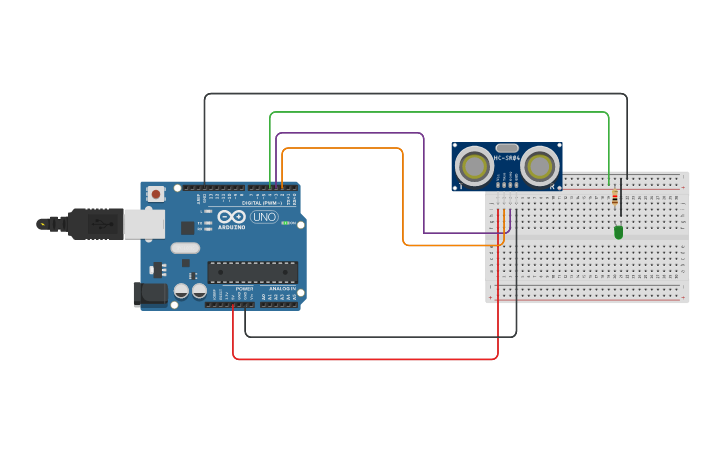

---
jupytext:
  formats: ipynb,md:myst
  text_representation:
    extension: .md
    format_name: myst
    format_version: 0.13
    jupytext_version: 1.10.3
kernelspec:
  display_name: Python 3
  language: python
  name: python3
---

# Célérité du son dans l'air - Réalisation de l'expérience
## Obtention des données expérimentales
### Principe et protocole
On désire mesurer la célérité du son dans l'air un grand nombre de fois. On va pour cela utiliser un émetteur récepteur ultrasons et une carte Arduino. 

*Principe de mesure* : On place un obstacle à une distance $d$ de l'émetteur-récepteur puis on va mesurer le temps de vol $t$. On peut obtenir la célérité du son grâce à la relation $c = \frac{2d}{t}$.

Pour plus de précision, on va réaliser des mesures pour plusieurs distances $d$ et on réalisera une régression linéaire en traçant $t$ en fonction de $d$. La pente permettra de remonter à la célérité du son. Le montage réalisé est donné ci-dessous (on place l'obstacle devant l'émetteur).

*La LED sert simplement pour avertir que l'émetteur récepteur est en train de faire une mesure*

La carte Arduino sera programmée pour renvoyer N mesures du temps de vol (N est choisi par l'expérimentateur).

+++

### Programmation de la carte Arduino.
1. Télécharger le __dossier__ depuis le site de la classe __sur l'ordinateur du laboratoire__. Ouvrir le logiciel Arduino et ouvrir le fichier `vitesse_son_2.ino`.
2. Réaliser le montage ci-dessus (bien respecter le numéro des bornes de branchement) et brancher la carte Arduino à l'ordinateur.
3. Sélectionner le port associé à sa carte (`Outils > Port`). Noter le nom de la carte, vous en aurez besoin plus tard. Téléverser alors le programme dans Arduino. Le microcontrolleur est en attente.
4. Ouvrir dans `pyzo` le fichier `celerite_son_acquisition.py`. Ce programme va communiquer avec Arduino pour configurer l'acquisition puis enregistrer les données. Changer le nom du port (ligne 7).
5. Exécuter le programme. Entrer un nom de fichier clair (éviter les espaces) et choisir 1000 échantillons.

## Traitement des données.
Créer un fichier de script dans pyzo pour :

1. Importer les données dans un vecteur. Utiliser le code expliqué [ici](https://pcsi3physiquestan.github.io/intro_python/notebook/import_file.html)
2. Tracer l'histogramme des mesures et vérifier qu'il n'y a pas visuellement de mesures aberrantes.
3. Si c'est le cas, supprimer les données aberrantes en appliquant le processus de sélection présenté [ici](https://pcsi3physiquestan.github.io/intro_python_td/notebook/exo_science_2.html#celerite-des-ultrasons).
4. Déterminer alors la célérité associée à chaque temps de vol puis la célérité moyenne et son écart-type. Comparer cette valeur à la valeur attendue.

