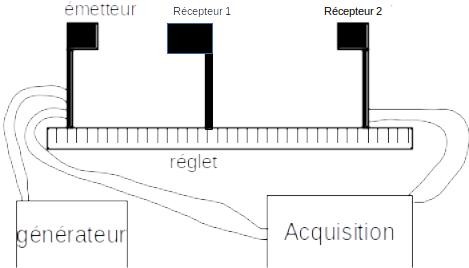

---
jupytext:
  formats: ipynb,md:myst
  split_at_heading: true
  text_representation:
    extension: .md
    format_name: myst
    format_version: 0.13
    jupytext_version: 1.11.1
kernelspec:
  display_name: Python 3
  language: python
  name: python3
---

# (Travail) Etude préliminaire


## Conception
Vous devrez proposer un protocole expérimental rédigé sur le sujet suivant. On rappelle que vous devez présenter le __but de l'expérience__, le __principe de mesure__ puis le __mode opératoire__ de façon __precise et concise__.

### Matériel à disposition
On désire mesurer la célérité des ultrasons dans l'air. On dispose du matériel suivant :
* Emetteur ultrason capable d'envoyer un signal ultrason en continu ou par salves.
* 2 Récepteurs ultrasons transformant le signal reçu en une tension mesurable.
* Carte d'acquisition et ordinateur permettant la mesure des signaux émis et reçus par l'émetteur et le récepteur (moyennant branchements) et l'affichage de leur évolution dans le temps.
* Alimentation continue 0-15V permettant d'alimenter l'émetteur
* Réglet
* Fils de connexion pour la carte d'acquisition et le générateur.

### Description particulière

#### Emetteur Ultrason

L'[emetteur ultrason](emetteur) est un boitier créant lui même le signal électrique alimentant une cellule piezoélectrique qui émet ainsi un signal ultrason. Il nécessite d'être alimenté par une tension continue de 15V.

```{figure} ./images/emetteur.jpg
:name: emetteur
:align: center
Emetteur ultrasons
```

Les réglages possibles sont :
* Une molette permet d'ajuster la __fréquence__ (autour de 40kHz) : La cellule piézo-électrique est un filtre passe-bande, il y a donc une fréquence pour laquelle l'émission sera maximale. Cette molette permet de la régler (placer un récepteur juste devant l'émetteur et ajuster la fréquence jusqu'à ce que le signal reçu soit maximal).
* Passage en émission continu ou par salve. Il existe deux types de salves :
    * salves courtes : durée d'émission de 1ms puis 4ms de silence
    * salves longues : durée d'émission de 6ms puis 4ms de silence

+++

### Réponse
Rédiger par écrit le protocole expérimental. __N'oubliez pas un schéma de votre montage.__

+++

### Exemple de réponse
__Après__ avoir réfléchi au protocole, vous pouvez afficher une proposition de protocole (_croix à droite_).

```{toggle}
__But__ : On veut déterminer la célérité des ultrasons dans l'air.

__Principe__ : La célérité $c$ du son permet de relier la distance $d$ parcourue par l'onde au temps de parcours $\Delta t$ :
$$c = \frac{d}{\Delta t}$$

__Mode opératoire__ : 
1. On réalise le montage ci-après. L'émetteur emet des salves courtes. 
3. On mesure les positions $d_1$ et $d_2$ des deux récepteurs sur le réglet puis la distance $d = d_2 - d_1$.
2. On acquiert en même temps les signaux reçus par les deux récepteurs.
3. On peut déterminer les instants $t_1$ correspondant au maximum du signal reçu par le récepteur 1 et $t_2$ correspondant au maximum du signal reçu par le récepteur 2. Le temps de vol est estimé par $\Delta t = t_2 - t_1$.
5. On détermine alors la célérité du son par $c = \frac{d}{\Delta t}$



__Remarques:__

* L'utilisation d'un schéma du montage est indispensable à chaque protocole.
```

+++

## Analyse des mesurandes directs.
Dans cette étude préliminaire, vous devez déterminer _précisément_ quels sont les mesurandes _directs_ que vous allez mesurer durant la manipulation.

On rappelle que ce sont ceux que vous mesurez directement durant la manipulation, sans devoir réaliser un calcul supplémentaire.

Vous préciserez au moyen de quel instrument sont mesurés chaque grandeur.

Après avoir réfléchi à la question, vous pouvez la réponse en cliquant sur la croix à droite.

```{toggle}
Pour mesurer la célérité du son, on doit, dans le protocole choisi mesurer le temps de vol $\Delta t$ et la distance entre les récepteurs $d$. __Mais ce ne sont pas ces grandeurs qu'on mesure directement.__

En réalité, on va mesurer directement :
* La position $d_1$. Elle sera repérée sur le réglet.
* La position $d_2$. Elle sera repérée sur le réglet.
* Le temps du maximum du signal émis $t_1$. Il sera lu graphiquement sur le tracé temporel du signal (logiciel sur ordinateur).
* Le temps du maximum du signal émis $t_2$. Il sera lu graphiquement sur le tracé temporel du signal (logiciel sur ordinateur).

Cette phase de réflexion est importante car on confond souvent les grandeurs qu'on veut avoir et les grandeurs qu'on mesure directement. De plus, c'est sur CES grandeurs qu'on va faire un bilan des sources d'incertitudes.
```
